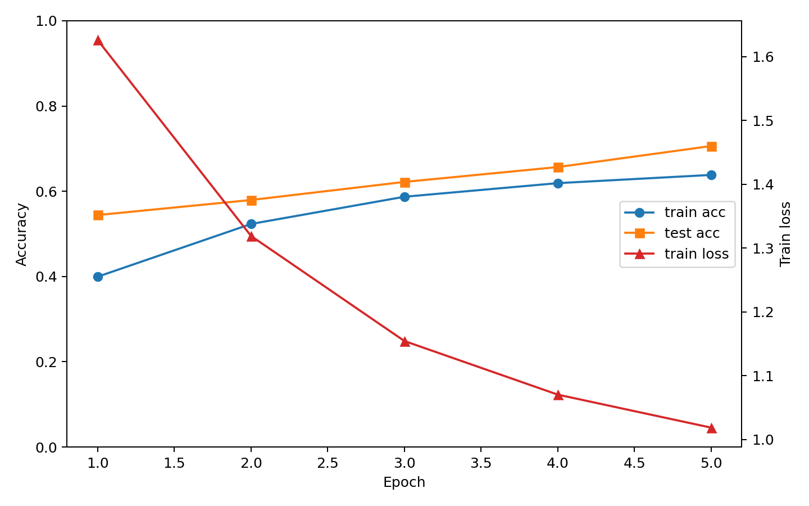
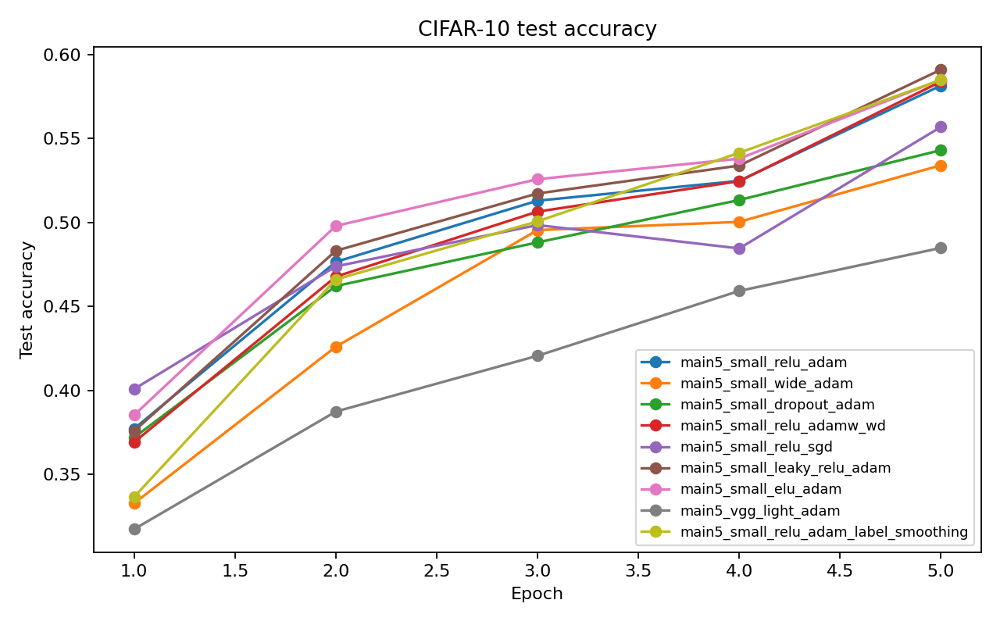
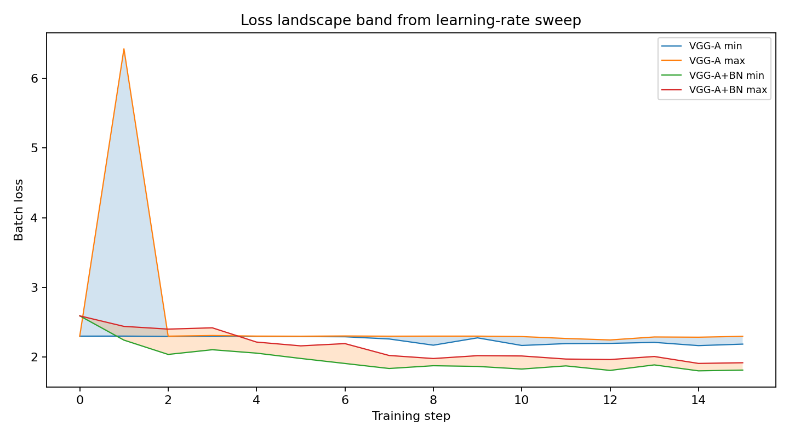
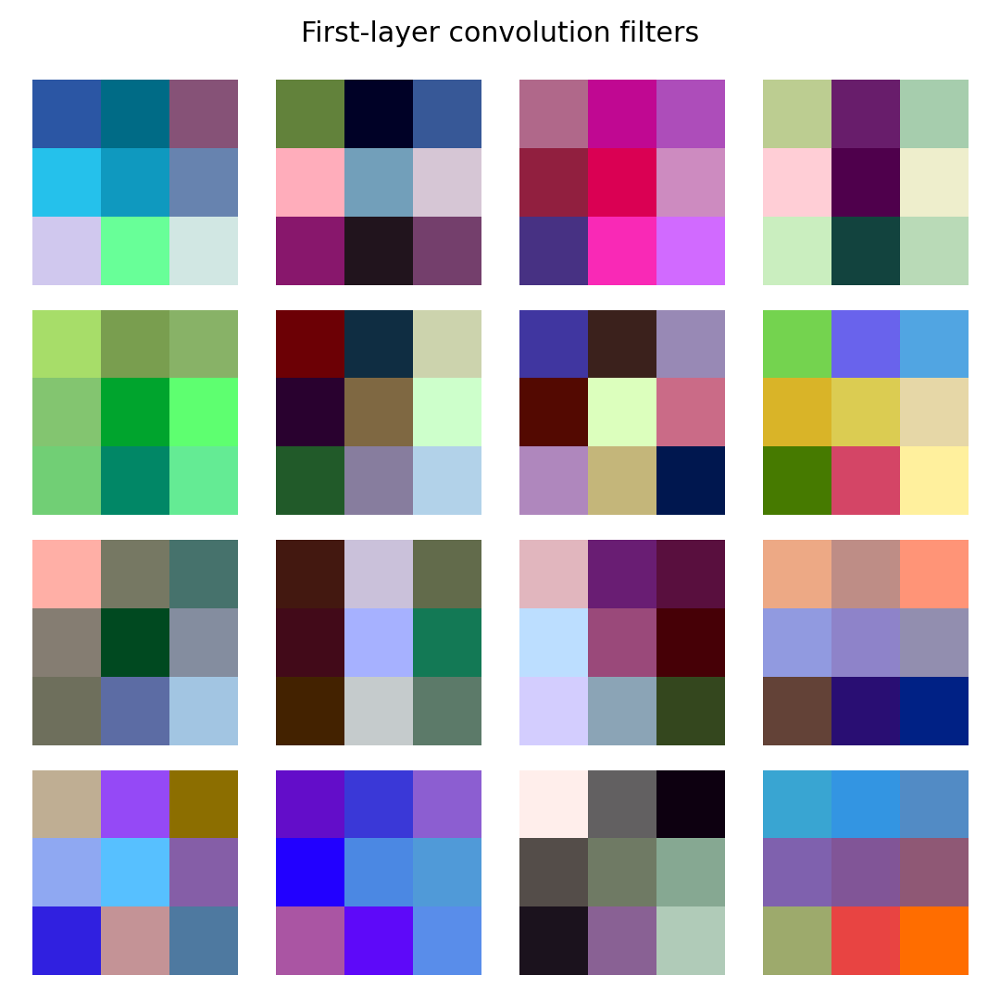
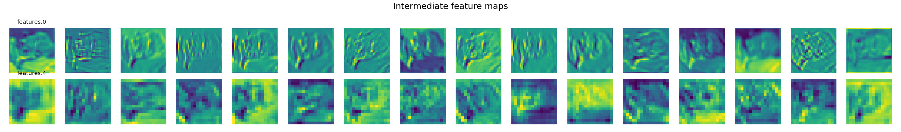
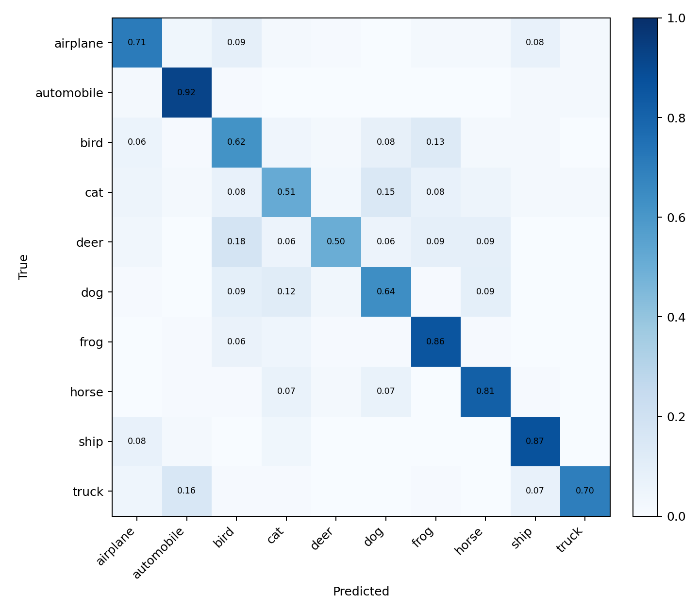
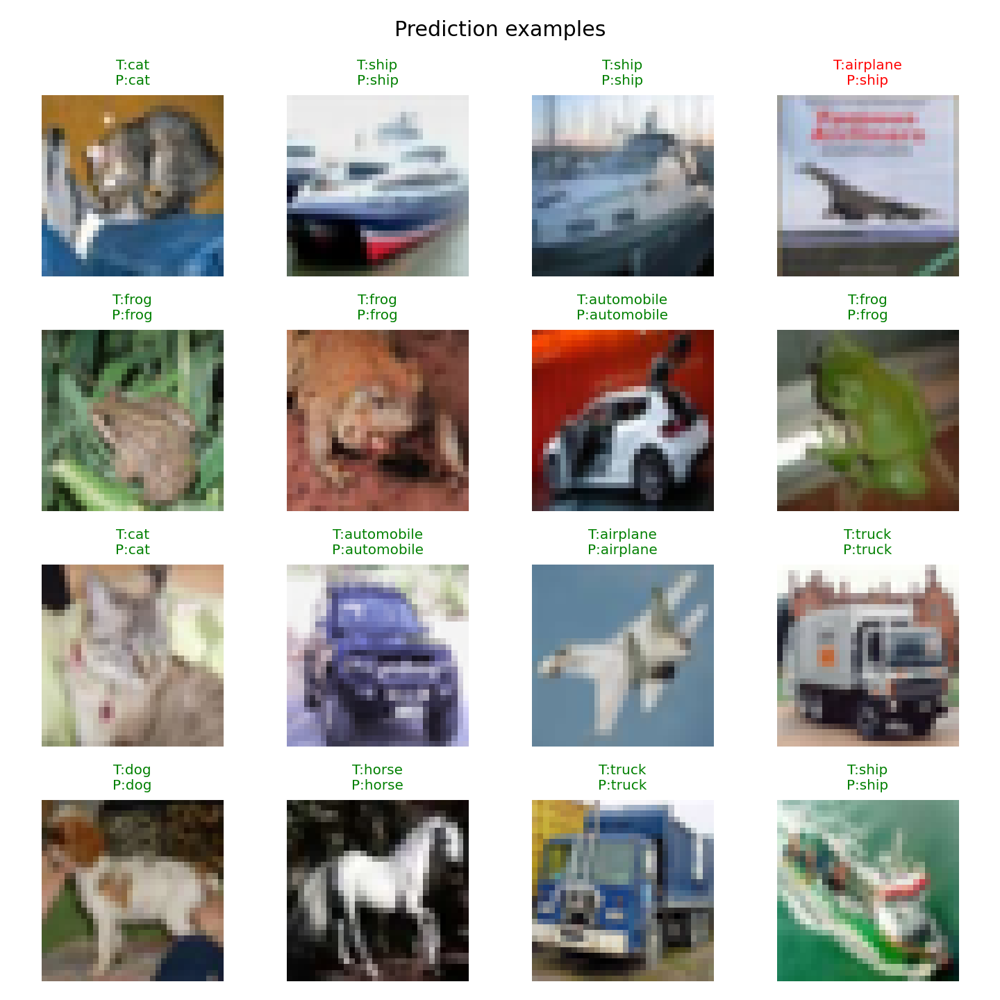

# Project 2：Neural Network and Deep Learning

- 姓名：余淏天
- 学号：23307140085
- 代码仓库链接：`[请填写 GitHub 链接]`
- 数据集链接：https://scidata.sjtu.edu.cn/records/p4t8m-rbe26
- 模型权重链接：`[请填写上传后的模型权重链接]`

## 实验背景

本项目围绕 CIFAR-10 图像分类与 Batch Normalization 的优化作用展开。第一部分在 CIFAR-10 上训练多个卷积神经网络，比较不同卷积核数量、激活函数、正则化方式和优化器对分类性能的影响，并报告当前实验中取得的最好测试错误率。第二部分基于 VGG-A 与加入 Batch Normalization 的 VGG-A 进行对比实验，通过不同学习率下的 loss 曲线区间来观察 BN 对优化 landscape 平滑性的影响。

实验使用 PyTorch 完成。完整 CIFAR-10 数据集已经下载并通过 MD5 校验，最终模型使用完整 50,000 张训练图像训练，并在完整 10,000 张测试图像上评估。由于 VGG-A 参数量较大，BN loss landscape sweep 按作业说明中允许的 `n_items` 思路使用训练子集进行快速对比，但测试仍使用完整测试集。

## 数据

CIFAR-10 包含 60,000 张 32 x 32 RGB 图像，共 10 类：airplane、automobile、bird、cat、deer、dog、frog、horse、ship、truck。标准划分为 50,000 张训练图像与 10,000 张测试图像。

本地数据集信息如下：

| 项目 | 内容 |
| --- | --- |
| 训练集数量 | 50,000 |
| 测试集数量 | 10,000 |
| 下载来源 | 上海交通大学开放数据平台 CIFAR-10 镜像 |

预处理方式如下：

```python
transforms.Compose([
    transforms.ToTensor(),
    transforms.Normalize((0.5, 0.5, 0.5), (0.5, 0.5, 0.5)),
])
```

训练时使用 `RandomCrop(32, padding=4)` 与 `RandomHorizontalFlip()` 做数据增强

## 一、CIFAR-10 网络训练

### 1.1 网络结构

最终选择的小型 CNN 结构包含作业要求的全部基本组件：

- 2D 卷积层：提取局部空间特征。
- BatchNorm2d：稳定中间激活分布。
- 激活函数：比较 ReLU、LeakyReLU、ELU。
- 2D MaxPooling：降低空间分辨率。
- Dropout：在部分实验中用于正则化。
- 全连接层：将卷积特征映射为 10 类 logits。

最终模型结构概括如下：

```text
Conv2d(3 -> 32, 3x3) -> BatchNorm2d -> ReLU -> MaxPool2d
Conv2d(32 -> 64, 3x3) -> BatchNorm2d -> ReLU -> MaxPool2d
Flatten
Dropout(0.1)
Linear(64 * 8 * 8 -> 256) -> ReLU
Dropout(0.1)
Linear(256 -> 10)
```

该模型参数量为 1,070,986。它同时包含卷积层、池化层、激活函数、全连接层和 BatchNorm/Dropout 组件，满足要求。

### 1.2 优化策略与对比实验

覆盖性实验使用 12,000 张训练图像训练 5 epochs，并在完整 10,000 张测试集上评估。覆盖作业要求中的不同结构、激活、正则化和优化器对比，同时生成完整的多 epoch 测试准确率曲线。

| 实验名 | 模型变化 | 优化器 | 学习率 | 正则化 | 参数量 | 测试准确率 | 测试错误率 |
| --- | --- | --- | --- | --- | --- | --- | --- |
| small_relu_adam | 基线小型 CNN，ReLU | Adam | 0.001 | 无 | 1,070,986 | 58.14% | 41.86% |
| small_wide_adam | 更多 filters：32/64 -> 64/128 | Adam | 0.001 | 无 | 2,176,010 | 53.40% | 46.60% |
| small_dropout_adam | Dropout 提高到 0.4 | Adam | 0.001 | Dropout | 1,070,986 | 54.30% | 45.70% |
| small_relu_adamw_wd | AdamW + weight decay | AdamW | 0.001 | weight decay=1e-4 | 1,070,986 | 58.38% | 41.62% |
| small_relu_adam_label_smoothing | Label smoothing CrossEntropy | Adam | 0.001 | label_smoothing=0.1 | 1,070,986 | 58.48% | 41.52% |
| small_relu_sgd | SGD + momentum | SGD | 0.05 | weight decay=1e-4 | 1,070,986 | 55.68% | 44.32% |
| small_leaky_relu_adam | LeakyReLU | Adam | 0.001 | 无 | 1,070,986 | 59.09% | 40.91% |
| small_elu_adam | ELU | Adam | 0.001 | 无 | 1,070,986 | 58.49% | 41.51% |
| vgg_light_adam | VGG-A-Light | Adam | 0.001 | 无 | 285,162 | 48.48% | 51.52% |

从覆盖性实验看，`small_leaky_relu_adam` 在 12,000 张训练子集的 5 epoch 设置下效果最好，测试准确率为 59.09%。`small_relu_adamw_wd`、`small_elu_adam` 与 label smoothing CrossEntropy 也接近 58% 以上，说明激活函数、weight decay 和 loss 正则化都会影响收敛质量。加宽模型没有带来更好测试准确率，可能原因是训练子集较小且训练轮数有限，较宽模型更容易需要更充分的数据和调参。高 Dropout 在该设置下低于低 Dropout 基线，说明过强随机失活可能降低短训练阶段的拟合效率。

### 1.3 最终模型结果

最终模型训练比较了两个候选：覆盖性子集实验中表现最好的 `small_leaky_relu_adam`，以及完整训练集上已有较好表现的 `small_relu_sgd`。二者都使用完整 50,000 张训练图像训练 5 epochs，并在完整 10,000 张测试图像上评估。结果显示 `small_relu_sgd` 的测试准确率为 70.61%，高于 `small_leaky_relu_adam` 的 69.29%，因此最终选择 `small_relu_sgd`。

| Epoch | 训练 loss | 训练准确率 | 测试 loss | 测试准确率 | 测试错误率 |
| --- | --- | --- | --- | --- | --- |
| 1 | 1.6259 | 39.96% | 1.2757 | 54.42% | 45.58% |
| 2 | 1.3189 | 52.33% | 1.2003 | 57.95% | 42.05% |
| 3 | 1.1542 | 58.71% | 1.0638 | 62.19% | 37.81% |
| 4 | 1.0702 | 61.90% | 0.9556 | 65.68% | 34.32% |
| 5 | 1.0184 | 63.83% | 0.8409 | 70.61% | 29.39% |

最终最佳测试准确率为 **70.61%**，最佳测试错误率为 **29.39%**。最终模型权重保存在：

```text
reports/project2_experiments/runs/final_small_relu_sgd_full_5ep/model.pt
```

最终模型训练曲线见：

```text
reports/project2_experiments/figures/final_model_training_curve.png
```



覆盖性实验测试准确率曲线见：

```text
reports/project2_experiments/figures/test_accuracy_curves.png
```



## 二、Batch Normalization 实验

### 2.1 BN 算法

对四维卷积激活张量 `I[b, c, x, y]`，Batch Normalization 对每个通道分别统计 mini-batch 和空间维度上的均值与方差：

```text
O[b, c, x, y] = gamma[c] * (I[b, c, x, y] - mu[c]) / sqrt(var[c] + eps) + beta[c]
```

其中 `mu[c]` 和 `var[c]` 是第 `c` 个通道的均值和方差，`gamma[c]` 与 `beta[c]` 是可学习参数。训练时使用 batch 统计量，测试时使用 running mean 和 running variance。

### 2.2 VGG-A 与 VGG-A+BN

本项目在 `codes/VGG_BatchNorm/models/vgg.py` 中补充了 `VGG_A_BatchNorm`。该模型与 `VGG_A` 保持相同的卷积/池化/全连接主体结构，只是在卷积层后加入 `BatchNorm2d`，在前两个全连接层后加入 `BatchNorm1d`。这样可以较为直接地观察 BN 对训练过程的影响。

| 模型 | 参数量 |
| --- | --- |
| VGG-A | 9,750,922 |
| VGG-A+BN | 9,758,474 |

### 2.3 学习率 sweep 与 loss landscape

为了观察 BN 对优化 landscape 的影响，使用学习率：

```text
[1e-3, 2e-3, 1e-4, 5e-4]
```

每个学习率分别训练 VGG-A 与 VGG-A+BN。由于 VGG-A 模型较大，实验使用 4,000 张训练图像进行 1 epoch 的快速 sweep，并在完整测试集上评估。每一步 batch loss 都被记录下来。对同一训练 step，取四个学习率 run 中 loss 的最大值与最小值，构造 `max_curve` 和 `min_curve`，并用 `fill_between` 画出 loss 区间。

| 模型 | 学习率 | 测试准确率 | 测试错误率 |
| --- | --- | --- | --- |
| VGG-A | 0.001 | 16.76% | 83.24% |
| VGG-A+BN | 0.001 | 10.00% | 90.00% |
| VGG-A | 0.002 | 11.71% | 88.29% |
| VGG-A+BN | 0.002 | 7.99% | 92.01% |
| VGG-A | 0.0001 | 20.14% | 79.86% |
| VGG-A+BN | 0.0001 | 11.41% | 88.59% |
| VGG-A | 0.0005 | 20.35% | 79.65% |
| VGG-A+BN | 0.0005 | 14.98% | 85.02% |

loss landscape 图保存于：

```text
reports/project2_experiments/figures/bn_loss_landscape.png
```



loss band 的平均宽度统计如下：

| 模型 | 对齐 step 数 | 平均 band 宽度 | 最大 band 宽度 |
| --- | --- | --- | --- |
| VGG-A | 16 | 0.3067 | 4.1184 |
| VGG-A+BN | 16 | 0.1697 | 0.3630 |

从 loss band 看，VGG-A+BN 在不同学习率下的 loss 区间更窄，最大波动也明显低于 VGG-A。这支持“BN 使优化 landscape 更平滑、降低学习率敏感性”的解释。不过，这组 BN sweep 只训练了 1 epoch，测试准确率并未体现出 BN 的最终泛化优势；BN 的 running statistics 在短训练下还不充分，且 VGG-A 参数量较大，需要更多 epoch 才能公平比较最终精度。因此，本实验仅用于观察优化过程的稳定性，而不判定 BN 的最终分类性能。

## 三、网络洞察与可视化

除了 loss landscape，本项目还从多个角度分析最终模型的行为：卷积核、中间层 feature maps、混淆矩阵和预测样例。这样可以同时观察模型学到的低级视觉模式、中间激活响应、类别间混淆关系和具体预测案例。

### 3.1 第一层卷积核

首先可视化最终模型第一层卷积核。图像保存于：

```text
reports/project2_experiments/figures/final_model_filters.png
```

第一层卷积核主要学习低级视觉模式，例如颜色对比、局部边缘和纹理方向。这符合卷积网络在图像任务中的常见现象：浅层特征偏向边缘、颜色和纹理，深层特征再组合成类别相关的高层模式。



### 3.2 中间层 feature maps

为了观察输入图像经过网络后的中间激活，本项目进一步可视化了第一和第二个卷积层的 feature maps，对应模型中的 `features.0` 与 `features.4`。图像保存于：

```text
reports/project2_experiments/figures/final_model_feature_maps.png
```



从 feature maps 可以看到，第一层响应仍保留较多局部边缘和颜色区域信息；第二层经过卷积、BN、ReLU 和池化后，响应更稀疏，更偏向局部结构组合。这说明网络不是直接记忆原图，而是在逐层提取更抽象的判别特征。

### 3.3 混淆矩阵

为了分析模型在不同类别上的错误模式，本项目使用测试集前 1,000 张图像绘制归一化混淆矩阵。该子集上的准确率为 71.70%，与完整测试集 70.61% 接近。图像保存于：

```text
reports/project2_experiments/figures/final_model_confusion_matrix.png
```



混淆矩阵可以帮助观察哪些类别更容易混淆。例如动物类别之间、交通工具类别之间通常更容易出现误判；这可能源于 CIFAR-10 图像分辨率较低、类内姿态变化较大的特点。

### 3.4 预测样例

最后，本项目展示了一组测试样例的真实标签和预测标签。绿色标题表示预测正确，红色标题表示预测错误。图像保存于：

```text
reports/project2_experiments/figures/final_model_prediction_examples.png
```



预测样例有助于直观看到模型的成功和失败案例。部分错误样例通常来自物体较小、背景复杂、类别外观相近或图像低分辨率导致的细节缺失。

## 四、结论

本项目完成了 CIFAR-10 数据集下载与校验、CNN 分类实验、不同结构与优化策略对比、VGG-A 与 VGG-A+BN 对比、loss landscape 可视化和卷积核可视化。

主要结论如下：

1. 在 12,000 张训练子集的 5 epoch 覆盖性实验中，`small_leaky_relu_adam` 表现最好，测试准确率为 59.09%。
2. 使用完整训练集训练 5 epochs 后，最终模型测试准确率达到 70.61%，测试错误率为 29.39%。
3. 加宽模型在短训练中没有提升效果，说明更大的参数量需要更充分训练和更细致的学习率设置。
4. 高 Dropout 在 5 epoch 子集对比中没有带来提升，说明过强随机失活会降低短训练阶段的拟合效率；较温和的 Dropout 仍保留在最终小型 CNN 中作为基础正则化。
5. Label smoothing CrossEntropy 取得 58.48% 的子集测试准确率，略高于普通 ReLU+Adam，说明 loss 层面的正则化也能改善泛化。
6. BN sweep 的 loss band 显示 VGG-A+BN 的 loss 波动区间更窄，支持 BN 平滑优化 landscape、降低学习率敏感性的解释。
7. BN 的最终准确率优势没有在 1 epoch sweep 中充分体现，后续可以延长 VGG-A/VGG-A+BN 训练轮数，以更公平比较最终泛化性能。

## 五、代码及附件说明

| 类型 | 路径 |
| --- | --- |
| 实验脚本 | `experiments/run_project2_experiments.py` |
| 实验汇总 | `reports/project2_experiments/summary.json` |
| 最终模型指标 | `reports/project2_experiments/runs/final_small_relu_sgd_full_5ep/metrics.json` |
| 最终模型权重 | `reports/project2_experiments/runs/final_small_relu_sgd_full_5ep/model.pt` |
| 测试准确率图 | `reports/project2_experiments/figures/test_accuracy_curves.png` |
| 最终模型训练曲线 | `reports/project2_experiments/figures/final_model_training_curve.png` |
| BN loss landscape 图 | `reports/project2_experiments/figures/bn_loss_landscape.png` |
| 卷积核可视化 | `reports/project2_experiments/figures/final_model_filters.png` |
| 中间层 feature maps | `reports/project2_experiments/figures/final_model_feature_maps.png` |
| 混淆矩阵 | `reports/project2_experiments/figures/final_model_confusion_matrix.png` |
| 预测样例 | `reports/project2_experiments/figures/final_model_prediction_examples.png` |

## 参考资料

- CIFAR-10 数据集镜像：https://scidata.sjtu.edu.cn/records/p4t8m-rbe26
- CIFAR-10 原始数据集：Alex Krizhevsky, Vinod Nair, Geoffrey Hinton, Learning Multiple Layers of Features from Tiny Images.

